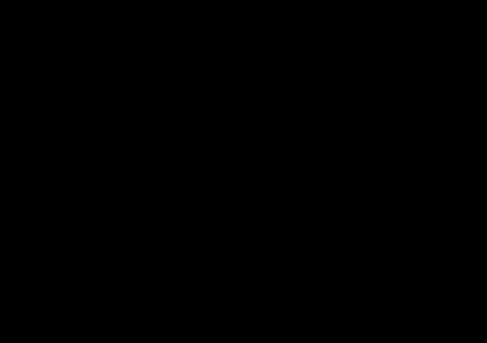

# AI Auto Answer

Chrome extension that generates personalized responses for CodeMentor and Upwork using AI with your voice profile. Works on CodeMentor mentorship requests (320 character limit) and Upwork proposal cover letters (~2200 characters).

## Screenshot



*The extension injects a smart suggestion card directly into the page, positioned near your response field. It shows the AI-generated proposal, lets you use/save it, and opens a refine chat with suggestion pills for quick edits.*

## Platforms

| Platform | URL Pattern | Char Limit | Voice |
|----------|-------------|------------|-------|
| CodeMentor | `codementor.io/m/dashboard/open-requests/*` | 320 | Casual, direct, opinionated |
| Upwork | `upwork.com/nx/proposals/job/*/apply/` | ~2200 | Professional, persuasive |

## Features

- **AI proposal generation** — generates a first draft automatically when you open a request or proposal page
- **Loading indicator** — subtle green pulse animation on the input field while generating, so you know the extension is active
- **Smart positioning** — card appears near the input field, not off-screen; stored position is cleared on each new page so it always repositions
- **Refine chat** — iterative refinement with full conversation history and version tracking
- **Suggestion pills** — quick refinement presets such as "make it shorter", "emphasize Kubernetes", "add AWS mention"
- **Save responses** — store good responses as few-shot examples for future generation
- **Resume context** — draws from your professional background when relevant to the request
- **Voice enforcement** — strips AI-ish phrases, enforces tone, respects character limits
- **SPA support** — detects navigation on Upwork's React SPA and re-initializes or cleans up automatically
- **Fallback model** — Groq Llama 3.3 70B as backup if Kilo Nemotron fails
- **Platform-gated loading** — only active on matching proposal URLs; fully cleans up when you leave

## Architecture

**Two models with fallback:**
1. **Primary:** Kilo Nemotron 3 Ultra (free tier, supports reasoning)
2. **Fallback:** Groq Llama 3.3 70B (fast, reliable)

**Voice profiles per platform:**
- Each platform has its own `VOICE_PROFILES` entry with formality, directness, banned phrases, signature phrases, and technical opinions
- `buildSystemPrompt(platform)` generates platform-specific system prompts
- `enforceVoiceRules(content, platform)` post-processes output to strip banned phrases and enforce character limits

## Build

```bash
npm install          # install dependencies
npm run build        # compile TypeScript + inject API keys from .env.local
npm run typecheck    # check types without emitting
npm test             # run quality benchmark
```

The build compiles `.ts` sources to `dist/`, injects API keys from `.env.local`, and strips module noise. Load the extension folder as an unpacked extension in Chrome.

## Project Structure

```
├── content.ts          # Content script (DOM injection, UI, selectors)
├── background.ts       # Service worker (AI calls, voice rules, storage)
├── popup.ts            # Popup UI script
├── build.ts            # Build script (compile + key injection + cleanup)
├── manifest.json       # Chrome extension manifest (v3)
├── popup.html          # Popup HTML
├── tsconfig.json       # TypeScript configuration
├── package.json        # npm scripts and dependencies
├── src/types.ts        # Shared TypeScript types
├── docs/voice-profile.md # Voice profile documentation
├── resume.txt          # Resume context for generation
├── test_benchmark.js   # Quality benchmark tests
└── dist/               # Build output (gitignored)
```

## Configuration

API keys are stored in `.env.local` and injected at build time. To update them, edit `.env.local` and run `npm run build`.

Voice profiles are defined in `background.ts` under `VOICE_PROFILES`. Adjust tone, banned phrases, signature phrases, and technical opinions there.
